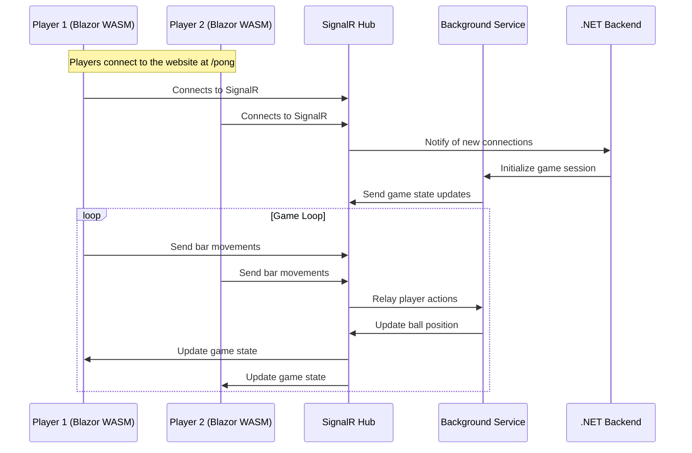

# Cloud Native Blazor Pong

Cloud Native Blazor Pong is a revival of the classic [BlazorPong](https://github.com/macel94/BlazorPong) with enhanced features including authentication, multi-room support, automatic infrastructure scalability, and a highscores page with statistical data on player performance.

# Architecture\Flow diagram

# Prerequisites

This will be removed and dev containers will be used instead.
Anyway, to use locally you need to have the following installed:
https://redis.io/docs/install/install-redis/install-redis-on-windows/
https://github.com/Azure/azure-signalr/blob/dev/docs/emulator.md

# What should the actual app do

Ideally in the /rooms page you should be able to see a list of rooms.
If you create a room you should be able to delete it.
If you join a room you should be able to either connect to play or to watch the game.
When creating a room, the GUID should be generated automatically and you should connect to a Signalr Hub.
Once connected, the SignalR Hub should save the connection details and container in a DB.
When you join a room you should be able to play pong with whoever is already inside, taking the connection details from the DB knowing the GUID of the Room that already exists.

# How to run the app
sudo service redis-server start
execute the blazor server and you should be good to go

# To Scaffold
dotnet ef dbcontext scaffold "Name=ConnectionStrings:AzureSql" Microsoft.EntityFrameworkCore.SqlServer -o .\EFCore -c PongDbContext --no-onconfiguring --project .\src\BlazorPong.Web\Server -f