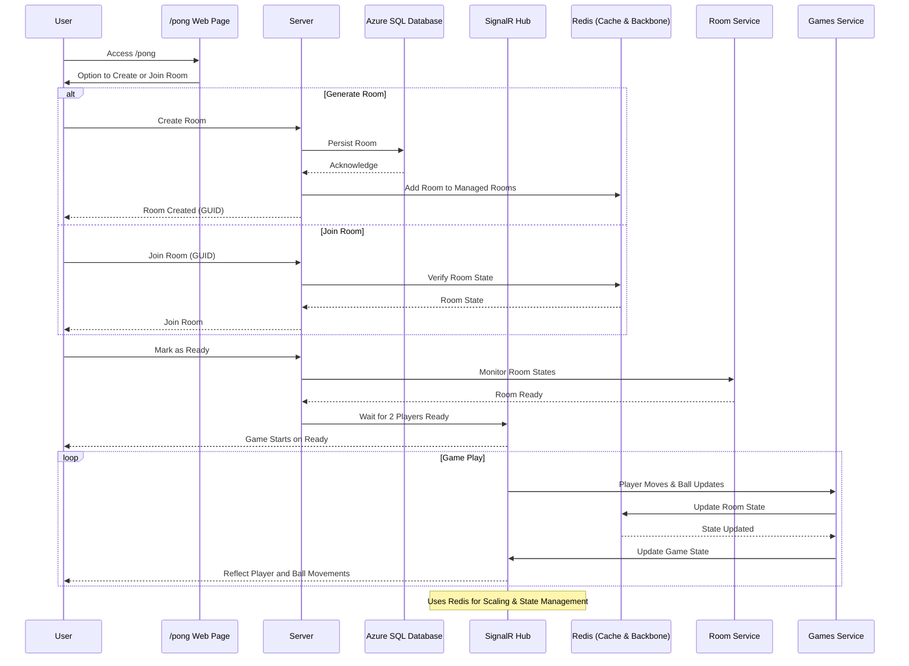

# Cloud Native Blazor Pong

Cloud Native Blazor Pong wants to be a revival of the classic [BlazorPong](https://github.com/macel94/BlazorPong) with enhanced features including authentication(or just the concept of identities, to start), multi-room support, automatic infrastructure scalability, and a highscores page with statistical data on player performance.

# Architecture\Flow diagram

This was generated using chatgpt, so it's not perfect, but it's a good start.

Prompt: generate a mermaidjs that represents the flow of this project.

it should include that:
the frontend is distributed from the backend server at the first get, and it's a blazor webassembly frontend.
when the users lands on the /pong page, they can generate or join a room though a guid.
when someone generates a room it is persisted in an azure sql database.
one of the many backend servers then picks up the new room through a background service(RoomService) that polls the azure sql db and adds it to the in-memory dictionary that the GamesService is based on.
Another background service(GamesService) managed the rooms locked for each backend waiting for 2 players to click on the ready button when they are in that room(that information is in the state of the room and is persisted on the redis cache).
then though a signalr connection, both the player can move their block up and down while the background service sends periodically the ball movements, so that they can play and eventually score and win.

horizontal scaling of backend servers that serve the frontend and contain the signalr hub and background services is guaranteed using redis as the backbone and also as the distributed cache for the state of each room.

# Prerequisites

This will be removed and dev containers will be used instead.
Anyway, to use locally you need to have the following installed:
https://redis.io/docs/install/install-redis/install-redis-on-windows/
https://github.com/Azure/azure-signalr/blob/dev/docs/emulator.md

# What should the actual app do

Ideally in the /rooms page you should be able to see a list of rooms.
If you create a room you should be able to delete it.
If you join a room you should be able to either connect to play or to watch the game.
When creating a room, the GUID should be generated automatically and you should connect to a Signalr Hub.
Once connected, the SignalR Hub should save the connection details and container in a DB.
When you join a room you should be able to play pong with whoever is already inside, taking the connection details from the DB knowing the GUID of the Room that already exists.

# How to run the app
sudo service redis-server start
execute the blazor server and you should be good to go

# To Scaffold
dotnet ef dbcontext scaffold "Name=ConnectionStrings:AzureSql" Microsoft.EntityFrameworkCore.SqlServer -o .\EFCore -c PongDbContext --no-onconfiguring --project .\src\BlazorPong.Web\Server -f
